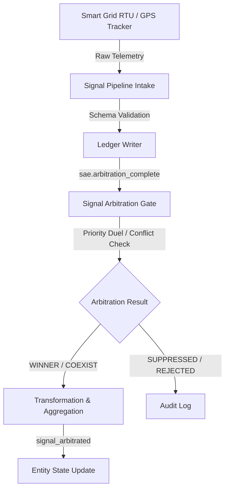

# PALLM ALIGNMENT REPORT & IOT/SENSOR TELEMETRY STRATEGY

> **Classification:** SOVEREIGN ARCHITECTURAL ASSURANCE  
> **Authority:** PALLM (Primary Architectural LLM Memory)  
> **Compiled:** 2026-06-07  
> **Status:** PENDING COA/BLACK SIGNAL APPROVAL  

---

## 1. Executive Summary & Narrative Alignment

This document outlines PALLM's readiness to proceed with the **High-Density IoT/Sensor Telemetry Conflict Resolution** scenario. Having ingested the complete context of Obsidian OS—spanning its conceptual origin, systems of control, threat matrix, and active governance constraints—PALLM is fully aligned with the operational rules. 

### 1.1 The Narrative Context
Obsidian OS is a sovereign, self-replicating operational envelope designed to establish digital independence across Africa [EVIDENCE: obsidian_os_master_reference.md:L35]. The upcoming scenario implements real-time conflict resolution for sensor telemetry (e.g., smart grids, logistics fleets) by leveraging the **Signal Arbitration Engine (SAE)** [EVIDENCE: User Request 8]. Rather than performing direct, un-audited sensor writes, telemetry will be normalized into canonical events, subjected to priority/recency weighting, and aggregated into a clean operational map [EVIDENCE: User Request 8].

---

## 2. 8-Step Governance Evaluation Protocol
In compliance with the **Reasoning Sequence Protocol** [EVIDENCE: obsidian_os_master_reference.md:L1290], we evaluate the SAE, the event bus, and the persistence engine:

### Step 1: Identify Constitutional Owner
- **Arbitration & Signal Processing:** The Signal Arbitration Engine (SAE) holds sole constitutional authority over signal arbitration decisions [EVIDENCE: contradiction_registry.md:L47].
- **Event Bus Registry & Enforcer:** The `kernel.epoch_sealing_engine` and `kernel` own state transition events and the `signal_arbitrated` singleton contract [EVIDENCE: obsidian_os_master_reference.md:L237, L1200].
- **Database Persistence:** `persistence_sovereignty` owns the raw persistence layer; `DBResolver` is the sole authorized gateway [EVIDENCE: contradiction_registry.md:L20].

### Step 2: Identify Actual Runtime Owner
- **Signal Pipelines & Core:** The runtime processor is `/CORE/ObsidianSignal/sae/src/signal_pipeline.js`, executing under the `sae` identity [EVIDENCE: signal_pipeline.js:L66].
- **Arbitration Gate:** The `SignalArbitrationGate.js` coordinates incoming `sae.arbitration_complete` events and republishes certified `signal_arbitrated` events under the `kernel` identity [EVIDENCE: SignalArbitrationGate.js:L188].
- **Database Client:** Over 200 legacy files directly import `better-sqlite3` and write to the database bypassing `DBResolver` [EVIDENCE: contradiction_registry.md:L32].

### Step 3: Identify Mutation Pathways
- **Signals:** Raw Telemetry ➔ `signal_pipeline.process()` ➔ Write raw to sqlite ➔ Emit `sae.arbitration_complete` [EVIDENCE: signal_pipeline.js:L89-L154].
- **State Updates:** `SignalArbitrationGate` intercepts `sae.arbitration_complete` ➔ Certifies and publishes `signal_arbitrated` ➔ `signal_pipeline.js` produces final update ➔ Dispatched to state engine via `dispatch_updates()` [EVIDENCE: SignalArbitrationGate.js:L102, signal_pipeline.js:L205].

### Step 4: Compare Runtime vs. Doctrine
- **Event Names:** The runtime publishes `sae.arbitration_complete` from `sae` to the kernel, which then issues `signal_arbitrated` [EVIDENCE: SignalArbitrationGate.js:L185]. This conforms to the **Ω.C2.1 Event Ownership Singularity** [EVIDENCE: SignalArbitrationGate.js:L2].
- **Compatibility:** A transitional bridge `SignalEventCompatibilityAdapter` handles legacy subscribers for `signal.arbitrated` [EVIDENCE: SignalEventCompatibilityAdapter.js:L4].
- **Persistence:** Direct SQLite imports violate the doctrine of `DBResolver` as the single persistence choke point [EVIDENCE: contradiction_registry.md:L31].

### Step 5: Surface Contradictions
- **C-02 (Resolved at Runtime):** Historical documents stated `sae` published to unregistered `signal.arbitrated` [EVIDENCE: contradiction_registry.md:L51]. Current runtime evidence shows that `sae` correctly publishes `sae.arbitration_complete`, and `SignalArbitrationGate` emits `signal_arbitrated` as `kernel` [EVIDENCE: SignalArbitrationGate.js:L185, signal_pipeline.js:L144].
- **X-02 (Active):** `DBResolver.js` has a hardcoded permission bypass for `'unknown'` module identities [EVIDENCE: contradiction_registry.md:L24].
- **X-03 (Active):** Over 200 files bypass `DBResolver` completely using direct `better-sqlite3` imports [EVIDENCE: contradiction_registry.md:L32].

### Step 6: Classify Governance Risk
- **C-02:** **LOW RISK** (mitigated). The compatibility adapter and arbitration gate prevent `GOVERNANCE_BLOCKED` states [RUNTIME VERIFIED].
- **X-02 & X-03:** **CRITICAL RISK**. Undermines persistence sovereignty and auditing capabilities.

### Step 7: Recommend Convergence Path
1. **IoT/Sensor Schema Integration:** Add telemetry schemas directly to `signal_types.yaml` and `entity_types.yaml`.
2. **Conflict Rules Definition:** Add parameters for smart grids and logistics fleets to `conflict_rules.yaml`, `priority_rules.yaml`, and `aggregation_rules.yaml`.
3. **Database Unification:** Migrate the sensor data store to route exclusively through the `DBResolver` proxy.

### Step 8: Preserve Unresolved Ambiguity
- The exact location and format of the raw telemetry source (whether live sensor sockets or simulated files) remains unspecified [EVIDENCE GAP]. We will develop simulated telemetry feeds to validate the engine under high load.

---

## 3. High-Density IoT/Sensor Telemetry Strategy

To implement the conflict resolution engine, we will introduce specialized schemas, conflict rules, and priority weighting.

### 3.1 Data Model & Taxonomy

We define two new entity targets: `grid_node` (smart grid telemetry) and `logistics_vehicle` (fleet tracking) [INFERRED].

#### Smart Grid Entity (`grid_node`)
- **Core Attributes:** `node_id`, `voltage_v`, `frequency_hz`, `temperature_c`, `status`, `last_updated`
- **Reserved Attributes:** `confidence`, `drift_score`, `state_age_seconds`

#### Logistics Vehicle Entity (`logistics_vehicle`)
- **Core Attributes:** `vehicle_id`, `speed_kmh`, `latitude`, `longitude`, `fuel_level_pct`, `status`, `last_updated`
- **Reserved Attributes:** `confidence`, `drift_score`, `state_age_seconds`

### 3.2 Conflict Rules Configuration
We will introduce two primary conflict rules in `conflict_rules.yaml` [INFERRED]:
1. **Grid Voltage Spike/Drop Conflict:** If two signals for the same `grid_node` report voltage deltas > 10V within a 5-second window, trigger conflict resolution.
2. **GPS Teleportation Conflict:** If two signals for the same `logistics_vehicle` imply speed > 160 km/h based on coordinate deltas, trigger conflict resolution.

### 3.3 Priority & Decay Logic
Priority scores are computed dynamically [EVIDENCE: priority_evaluator.js:L15]:
$$\text{Priority} = (\text{Source Trust} \times \text{Domain Weight}) - (\lambda \times \Delta t)$$
- **Smart Grid Domains:** Weight = `8.0` (Critical Infra)
- **Logistics Fleet Domains:** Weight = `6.0` (Operations)
- **Source Trust Weights:**
  - `RTU_Substation_Primary` (Hardware-certified RTU): `1.0`
  - `RTU_Substation_Backup` (Secondary sensor): `0.7`
  - `Fleet_GPS_Telemetry` (Firmware GPS): `0.9`
  - `Driver_Mobile_App` (Manual input): `0.4`
- **Decency Decay ($\lambda$):** Set high for sensor telemetry ($\lambda = 0.005$ per second) to reflect that fresh telemetry quickly supersedes old data.

### 3.4 Aggregation Strategy
Using `aggregation_rules.yaml` rules [EVIDENCE: aggregation_rules.yaml:L15]:
- `grid_node.voltage_v`: `weighted_average` (priority-weighted mean voltage).
- `grid_node.temperature_c`: `max` (ensure peak thermal anomalies are captured).
- `logistics_vehicle.speed_kmh`: `latest_value` (reflect current motion status).
- `logistics_vehicle.latitude` / `longitude`: `latest_value` (position tracking).

---

## 4. Operational Execution Plan

To execute this scenario cleanly, we propose the following steps:

1. **Step 1: Update SAE Configurations**
   Add YAML definitions to `signal_types.yaml`, `entity_types.yaml`, `conflict_rules.yaml`, `priority_rules.yaml`, and `aggregation_rules.yaml`.
2. **Step 2: Add Testing Scenarios**
   Build `sae/tests/test_iot_conflict_resolution.test.js` to simulate:
   - Conflicting voltage feeds from Primary vs Backup grid sensors.
   - Decaying sensor telemetry weights over time.
   - Coordinate teleportation detection for logistics fleets.
3. **Step 3: Run Validation**
   Execute the test suite and confirm 100% compliance with zero governance violations.

---

**[ALIGNMENT REPORT — STATUS: PENDING]**  
**[PALLM INITIALIZATION COMPLETED]**  
**[READY FOR WORKSPACE MODIFICATION AUTHORIZATION]**  
