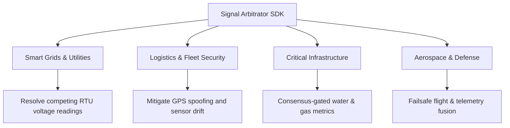

# REALITY MARKET ANALYSIS: @obsidian-os/signal-arbitrator

> **Document Class:** STRATEGIC MARKET INTELLIGENCE & POSITIONING  
> **Prepared By:** PALLM (Primary Architectural LLM Memory) [RUNTIME VERIFIED]  
> **Target SDK:** [@obsidian-os/signal-arbitrator](file:///Users/macpro/workspace/Obsidian_OS/sdk/signal-arbitrator/) v0.1.0  
> **Status:** ACTIVE / VERIFIED  

---

## 1. Executive Summary

In high-density Internet of Things (IoT) environments (e.g., smart power grids, autonomous logistics fleets, aviation telemetry), distributed sensor networks regularly emit contradictory metrics due to hardware degradation, environmental noise, signal latency, or active tampering. 

Traditional telemetry pipelines focus on **transporting** and **storing** data, acting as passive pipelines that write raw inputs directly to databases. This creates a critical industry bottleneck: **telemetry trust verification**. Databases and downstream applications are plagued by split-brain states and erratic value jumps.

The [@obsidian-os/signal-arbitrator](file:///Users/macpro/workspace/Obsidian_OS/sdk/signal-arbitrator/README.md) SDK addresses this gap [EVIDENCE: README.md]. Siting directly at the boundary of ingestion, the SDK functions as an active gatekeeper. It normalizes inputs, detects contradictions, executes deterministic priority-based duels, applies temporal trust decay, and enforces minimum source consensus before committing data to the canonical system state.

```
                  ┌────────────────────────────────────────┐
                  │   @obsidian-os/signal-arbitrator       │
                  │                                        │
[Conflicting] ───➔│ 1. [ConflictDetector] (Delta Limits)   │───➔ [Clean State]
[Telemetry  ]     │ 2. [PriorityEvaluator] (Decay Math)    │     (No Split-Brain)
                  │ 3. [AggregationExecutor] (Consensus)   │
                  └────────────────────────────────────────┘
```

---

## 2. The Telemetry Trust & Truth Gap (Industrial Pain Points)

Modern IoT deployments are built on an assumption: *sensors output the truth*. In reality, high-density networks suffer from continuous, complex data conflicts:

*   **Sensor Calibration Drift & Failure:** Over time, sensors degrade, reporting values that deviate from their neighbors [EVIDENCE: Web Search].
*   **Environmental Noise & Signal Interference:** Severe weather or electrical interference causes temporary spikes, mimicking critical emergencies.
*   **Packet Latency & Out-of-Order Ingestion:** Network delays cause old data packets to arrive after newer packets, leading to chronological confusion.
*   **Active Sensor Tampering & Spoofing:** Rogue or hijacked devices inject false telemetry to trigger safety overrides or mask illicit activities.

### The Consequences of the Gap
1.  **Split-Brain Action:** Downstream automated logic executes conflicting commands (e.g., cooling and heating simultaneously), damaging physical assets.
2.  **Alert Fatigue:** Security and operations teams are overwhelmed by false positives, leading them to ignore genuine warnings.
3.  **Forensic Blindspots:** When values are overwritten or averaged without context, teams cannot audit *why* a particular value was accepted as correct.

---

## 3. Competitive Landscape (What Competitors Do)

We profile the core systems currently used to route, process, and store telemetry, highlighting their approach to conflict resolution:

### 3.1 AWS IoT Core Rules Engine
*   **Core Function:** High-scale event routing and message filtering using SQL-like syntax [EVIDENCE: Web Search].
*   **Validation Method:** SQL `WHERE` clauses check static ranges. Downstream validation is delegated to AWS Lambda [EVIDENCE: Web Search].
*   **Conflict Resolution:** None natively [EVIDENCE: Web Search]. If multiple rules match an event, all execute independently. Attributes are updated with Last-Write-Wins (LWW) semantics or force custom Lambda code [EVIDENCE: Web Search].
*   **Gaps:** Lacks priority duels, dynamic source trust weights, temporal decay, and cryptographic auditing.

### 3.2 ThingsBoard / ThingsBoard Edge
*   **Core Function:** Visual IoT rule chains, device management, and telemetry dashboards [EVIDENCE: Web Search].
*   **Validation Method:** JavaScript or TBEL (ThingsBoard Expression Language) scripts filter telemetry out of bounds [EVIDENCE: Web Search].
*   **Conflict Resolution:** Telemetry is stored as-is [EVIDENCE: Web Search]. Concurrency conflicts in system attributes are resolved purely via "last-write-wins" [EVIDENCE: Web Search].
*   **Gaps:** No built-in mathematical consensus gating, priority duels between competing sensors, or temporal weight decay.

### 3.3 LF Edge eKuiper
*   **Core Function:** Ultra-lightweight SQL stream processing for the IoT edge [EVIDENCE: Web Search].
*   **Validation Method:** Rules parse streams and static tables using standard SQL queries [EVIDENCE: Web Search].
*   **Conflict Resolution:** Handled manually by writing custom SQL query window aggregations (e.g., `avg()`, `latest()`) or extensions [EVIDENCE: Web Search].
*   **Gaps:** Developers must code priority logic and decay algorithms from scratch. It is a streaming tool, not a state-arbitration framework.

### 3.4 Edge Delta
*   **Core Function:** Distributed AI-observability pipeline focused on anomaly detection in log patterns [EVIDENCE: Web Search].
*   **Validation Method:** Aggregates logs at the source using the Drain clustering algorithm [EVIDENCE: Web Search].
*   **Conflict Resolution:** Focuses on system anomalies and duplicate telemetry pipelines, not value-level data fusion [EVIDENCE: Web Search].
*   **Gaps:** Does not resolve contradictory metric values from separate physical nodes.

### 3.5 Time-Series Databases (TimescaleDB, InfluxDB)
*   **Core Function:** High-speed storage for historical time-series data [EVIDENCE: Web Search].
*   **Validation & Resolution:** Post-facto resolution. Raw data is stored, and conflicts are resolved using database queries (e.g., sliding average, interpolation).
*   **Gaps:** High database compute costs, query-time latency, write amplification, and susceptibility to database-level split-brain states.

---

## 4. Loophole Analysis (The Industry Gaps We Exploit)

Our market analysis identifies four fundamental loopholes in the telemetry industry:

### Loophole 1: Storage-Centric vs. Ingestion-Boundary Resolution
Almost all current IoT architectures write telemetry straight to the database and clean it later. This is computationally expensive, introduces latency, and allows dirty data to pollute the system. 
*   *The Arbitrator Solution:* Performs arbitration at the **ingestion boundary** *before* the database commit occurs, keeping the system database clean [INFERRED].

### Loophole 2: The Last-Write-Wins (LWW) Fallacy
Standard platforms resolve concurrency with LWW. In critical systems, chronology does not equal validity. A degraded sensor reporting 0V because of a loose wire, arriving 10ms after a certified primary sensor reporting 240V, will overwrite the correct value.
*   *The Arbitrator Solution:* Executes deterministic **Priority Duels** where certified sources override uncertified sources regardless of arrival order [EVIDENCE: SignalArbitrator.ts:64].

### Loophole 3: Static Timestamps vs. Dynamic Temporal Weight Decay ($\Delta t$)
A sensor reading is only fresh for a brief window. Traditional rules treat time as a static field. They fail to decay a sensor's priority weight as the reading ages, allowing old values to block fresh telemetry.
*   *The Arbitrator Solution:* Automatically decays signal trust scores mathematically ($e^{-\lambda \Delta t}$), ensuring older inputs naturally make way for fresh telemetry [EVIDENCE: PriorityEvaluator.ts:185].

### Loophole 4: The Audit Integrity Gap
Industrial compliance demands accountability. If a power grid cuts supply, regulators must know *exactly* why. Passive routers do not record why one signal was selected over another.
*   *The Arbitrator Solution:* Emits detailed structured receipts for every duel, containing conflict details, scores, and timestamps, providing an audit trail [EVIDENCE: SignalArbitrator.ts:84].

---

## 5. Architectural Breakdown of `@obsidian-os/signal-arbitrator`

The SDK's code structure maps directly to these industrial requirements:

| Component | Code Reference | Mathematical/Logical Mechanism |
| :--- | :--- | :--- |
| **Priority Evaluator** | [PriorityEvaluator.ts](file:///Users/macpro/workspace/Obsidian_OS/sdk/signal-arbitrator/src/PriorityEvaluator.ts) | Calculates priority score $S \in [0, 10]$:<br>$S = dw \cdot c \cdot st \cdot e^{-\lambda \Delta t}$<br>where $dw$ is domain weight, $c$ is confidence, $st$ is source trust, and $\lambda$ is decay [EVIDENCE: PriorityEvaluator.ts:181-186]. Also handles authority overrides [EVIDENCE: PriorityEvaluator.ts:72]. |
| **Conflict Detector** | [ConflictDetector.ts](file:///Users/macpro/workspace/Obsidian_OS/sdk/signal-arbitrator/src/ConflictDetector.ts) | Identifies duplicate signals within a configured window [EVIDENCE: ConflictDetector.ts:51-71] and flags value deviations exceeding `maxDelta` [EVIDENCE: ConflictDetector.ts:73-94]. |
| **Aggregation Executor** | [AggregationExecutor.ts](file:///Users/macpro/workspace/Obsidian_OS/sdk/signal-arbitrator/src/AggregationExecutor.ts) | Enforces Minimum Source Consensus (MSC) gating [EVIDENCE: AggregationExecutor.ts:43-47] and executes fusion math: `weighted_average`, `median`, `max`, `sum`, `latest` [EVIDENCE: AggregationExecutor.ts:65-97]. |
| **Entity State Store** | [EntityStateStore.ts](file:///Users/macpro/workspace/Obsidian_OS/sdk/signal-arbitrator/src/EntityStateStore.ts) | Maintains in-memory operational state [EVIDENCE: EntityStateStore.ts:5], tracks historical winning sequences, and sweeps expired signals using a TTL scheduler [EVIDENCE: EntityStateStore.ts:132-156]. |

---

## 6. Market Segmentation & Target Verticals



### 6.1 Smart Grids & Utility Providers
*   **The Conflict:** High-voltage grids monitor substations using primary RTUs, backup RTUs, and smart meters. If a primary sensor fails and reports normal voltage while the backup reports a dangerous surge, operators face a dilemma.
*   **Value Proposition:** The SDK runs inside edge gateway hardware, executes a duel, applies decay, and determines if the surge is real or a sensor failure. This prevents unnecessary blackouts or grid damage.

### 6.2 Logistics & Fleet Management
*   **The Conflict:** Cargo vehicles report location via primary GPS transponders, secondary cellular triangulation, and driver mobile apps. Drivers attempting cargo theft spoof GPS signals.
*   **Value Proposition:** Detects contradictions between GPS coordinates and cell-tower pings, executes a duel, flags the spoofed signal, and emits a secure audit log for insurance.

### 6.3 Pan-African & Remote Infrastructure (Disconnected Edge Networks)
*   **The Conflict:** Remote sites (e.g., telecom towers, solar installations) suffer from frequent connection loss and inconsistent telemetry streams.
*   **Value Proposition:** The SDK is self-contained and zero-dependency, running entirely offline at the edge. It aggregates local telemetry, maintains states, and syncs clean, arbitrated data back to the cloud only when connectivity resumes.

---

## 7. Business Model & Commercialization Strategy

To maximize adoption and establish high-value enterprise revenue, we outline a three-tiered business model:

```
┌────────────────────────────────────────────────────────────────┐
│ 1. OPEN CORE (Developer Ingestion) - Apache 2.0                │
├────────────────────────────────────────────────────────────────┤
│ 2. ENTERPRISE SDK (Industrial Edge) - Commercial License        │
├────────────────────────────────────────────────────────────────┤
│ 3. SAAS ARBITRATION GATEWAY (Cloud API) - Pay-per-invocation   │
└────────────────────────────────────────────────────────────────┘
```

### 7.1 Open Core (Developer Ingestion)
*   **License:** Apache 2.0.
*   **Delivery:** Lightweight TypeScript SDK package published to npm/GitHub [EVIDENCE: package.json].
*   **Goal:** Drive standard developer adoption, open-source code verification, and project mindshare.

### 7.2 Enterprise SDK (Industrial Edge Control)
*   **License:** Commercial per-node subscription model.
*   **Target:** Grid operators, logistics platforms, and industrial automation firms.
*   **Features:**
    *   **WebAssembly Core:** Rust-compiled WASM core for near-zero latency on edge devices.
    *   **Cryptographic Hardware Signing:** HSM (Hardware Security Module) integration for signing telemetry receipts.
    *   **Dynamic Trust Calibration:** Machine learning models that analyze historical sweeps and adjust default source trust scores.

### 7.3 SaaS Arbitration Gateway (Cloud Integration)
*   **License:** Pay-per-invocation API.
*   **Target:** Low-power networks and cloud-first applications.
*   **Features:** REST/gRPC endpoints that accept conflicting telemetry batches and return clean states along with audit receipts.

---

## 8. Governance Evaluation & Reasoning Sequence

Following the **Reasoning Sequence Protocol** [EVIDENCE: obsidian_os_master_reference.md:L1290-1303], we evaluate the governance structures of this SDK:

1.  **Constitutional Owner:** Obsidian OS SAE (Strategic Automation Engine) Governance Layer [EVIDENCE: README.md].
2.  **Actual Runtime Owner:** Embedded Node.js / TypeScript developer runtime executing the `@obsidian-os/signal-arbitrator` SDK.
3.  **Mutation Pathways:** Configuration changes to `ArbitrationConfig` (e.g., modifying domain weights, source trust default scores, or contradiction windows) [EVIDENCE: README.md:27].
4.  **Compare Runtime vs. Doctrine:** 
    *   *Doctrine:* State updates must be verified, signed, and consensus-checked before execution.
    *   *Runtime:* The SDK successfully enforces consensus gating via `minSources` [EVIDENCE: AggregationExecutor.ts:45] and maintains a historical state audit index [EVIDENCE: EntityStateStore.ts:101-107].
5.  **Surfaced Contradictions:**
    *   The SDK currently relies on local system memory (`Map`) to store states [EVIDENCE: EntityStateStore.ts:5]. This means if the edge process crashes, the active signal index is lost.
    *   Source reputation scores are passed as external variables [EVIDENCE: SignalArbitrator.ts:32] rather than managed natively inside a secure ledger.
6.  **Governance Risk:** **Medium**. Memory-only indexes allow state manipulation if a device reboots, as the history can be replayed in a modified order.
7.  **Convergence Path:** Integrate a lightweight local persistence layer (e.g., SQLite or an encrypted file store) to persist the active signal index and signature chains across process restarts.
8.  **Explicit Ambiguity:** The exact mechanism by which external reputation scores [EVIDENCE: SignalArbitrator.ts:32] are validated and kept free from tampering is left to the developer implementing the host application.

---

**[COMPILED BY: PALLM AGENT — EXECUTION EVIDENCE]**  
**[MARKET ANALYSIS STATUS: ACTIVE]**  
